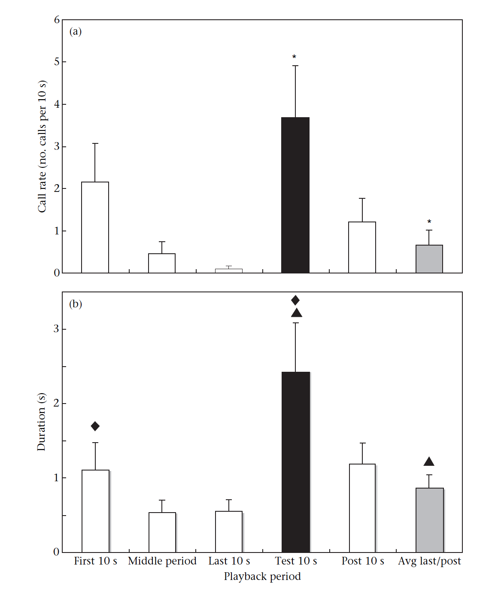

```{r setup, include=FALSE}
knitr::opts_chunk$set(
	echo = FALSE,
	warning = FALSE,
	comment = "##",
	prompt = TRUE,
	tidy = TRUE,
	tidy.opts = list(width.cutoff = 75),
	fig.path = "img/"
)
```

## Reanalysis of: Antiphonal calling allows  individual discrimination in white-winged vampire bats
#### Carter, G. G., Skowronski, M. D., Faure, P. A., and Fenton, B. 2008 Animal Behaviour. 76:4, 1343-1355

####Study background / goal of paper
This study investigated the function of social calls in  white-winged vampire bats. Bat social calls have complex acoustic structures which are capable of carrying a lot of information, as well as inter-individual variation that could contribute in individual recognition. The function of these calls in white-winged vampire bats, a highly social species, was unknown. This study tested several aspects of these social calls in several experiments: 1) whether calls elicit antiphonal responses,2) whether there is consistent individual variation in call structure, and 3) whether bats discriminate between the calls of individuals. For my analysis I am going to look  at the **third** component, individual discimination. 
     
####The habituation-discrimination test
The authors used a habituation-discrimination (also called habituation-dishabituation) paradigm for this task. This paradigm is widely used in psychology, and is a powerful tool for testing individual discrimination, not least because it requires no training. The basic test is as follows: **The goal is to test whether animals discriminate between any two stimuli** (say "stim A" and "stim B"). You present an animal repeatedly with stim A until the animal habituates to it, as demonstrated by a decline in response to the stimulus. Then, you change the stimulus to stim B. If it does not discriminate, then it will continue its habituated response. However, since habituation is stimulus specific, if an animal discriminates between stim A and stim B, then it will not be habituated to stim B, and it will respond to it at the initial level. You may be able to detect a difference in th rate of response.   If the animal has a low baseline response level to stim B, though, there may be no difference between that and the habituated response to A, which could erroneously lead you to conclude that there was no discrimination. You can overcome this by presenting the first stimulus again. If the animal discriminated between stim A and B, then hearing stim B should have dishabituated the animal to stim A. If you offer stim A again, it should respond to it more than it did at the end of habituation. 
     
#### Experimental methods    

So, the authors investigated whether bats discriminated between the social calls of different individuals. To do this, they put bats alone in a small enclosure. They respeatedly presented social calls from one individual bats, for  30 to 90 seconds, then changed the stimulus to the social call of another individual for 10 seconds, and finally presented the first stimulus for 10 more seconds. They measured 2 general responses 1) The number of antiphonal vocal calls produced in response to each experimental call, and 2) physical responses to each call, including either physical orientation towards the speaker, or startling from an eyes-closed position in response to the call. 
     
The experimenters organized the data in two ways, by pooling mean reponses to the stimuli by bat, and by pooling mean responses of all the bats to each sequence.  Each bat received a number of different trials with different experimental sequences, so the experimenters reported the mean responses by bat. Each stimulus sequence was also used more than once, so they also analyzed the data by sequence.These two different levels dive you different degrees of freedom (7 d.f. in the former and 15 in the latter). (I don't have the data for this, but you could analyze the relative amount of 'random' variation explained by sequence and by bat to see which is a more logical grouping factor).  

These are the column names, and what they mean:

For the 'by bat' data:
```{r, echo=TRUE}
#import bat data
gc_bat <- read.delim("https://raw.githubusercontent.com/maydixon/reanalysis_project_ada2016/master/gc_data_by_bat.txt", header= TRUE, sep="\t")
head(gc_bat)
```
For the 'by sequence' data:
```{r, echo=TRUE}
#import sequence data
gc_seq<- read.delim("https://raw.githubusercontent.com/maydixon/reanalysis_project_ada2016/master/gc_data_by_sequence.txt", header= TRUE, sep="\t")
head(gc_seq)
```
Basic column names (these are from the data pooled by bat, but columns are named similarly for the data pooled by sequence) :
```{r, echo=FALSE}
gc_bat_cols <- colnames(gc_bat)
gc_bat_cols
```
subject = bat ID  
vocal.first = the average number of calls the bat made in the first 10 seconds of habituation  
vocal.mid = the average number of calls the bat made in the middle 10 seconds of habituation  
vocal.last = the average number of calls the bat made in the final 10 seconds of habituation  
vocal.test = the average number of calls made during the 10 seconds of the new stimulus  
vocal.post = the average number of calls in the first 10 seconds when the first stimulus returned   
vocal.last.post = the average number of calls in the last 10 seconds when the first stimulus returned   
visual.first = the average number of physical responses the bat made in the first 10 seconds of habituation  
visual.mid = the average number of physical responses the bat made in the middle 10 seconds of habituation  
visual.last = the average number of physical responses the bat made in the final 10 seconds of habituation  
visual.test = the average number of physical responses made during the 10 seconds of the new stimulus  
visual.post = the average number of physical responses in the first 10 seconds when the first stimulus returned   
visual.last.post = the averaged number of physical responses for visual.last and visual.post   

#### Description of analyses run by Carter et al.:
Carter et al. must have determined that the data were decidedly non-normal, because they used non-parametric tests. They used Wilcoxon signed-rank tests to test whether the vocal and physical response to Stim A 10 before and after Stim B were significantly greater than the responses during Stim B. They repeated this analysis with the sequences as the base unit and with the bat subjects as the base unit. They also used a Wilcoxon signed-rank test to see whether the initial responses to Stim A were significantly different than the initial responses to Stim B (though all stimulus sequences were used as both Stim A and Stim B)

#### Description of reanalysis run by me:
I tested for normality, and ran all the Wilcoxon tests run by Carter et al. I also ran the Wilcoxon test for discrimination slightly differently, comparing only the response to the last 10s of Stim A to the response to Stim B.  I also ran a Friedman test to see whether bats actually did habituate to Stim A. All the tests for the bat-level data are shown, and then are repeated for the sequence level data underneath. 

## Analyses of Bat-level data
#### Exploratory stats

Are these data appropriate for parametric stats?
```{r}
# can I use parametric things?
library(reshape2)
library(ggplot2)
ggplot(melt(gc_bat), mapping=aes(x=value)) +
             geom_histogram(bins=20) +
             facet_wrap(~variable,scales='free_x')
```

So, it seems clear from the histograms that there are too few cases, and that they are no where near enough to normal, to use parametric statistics. 

This bat, "Kristina", is also a bit of an outlier:
```{r}
gc_bat[grep("kristina", gc_bat$subject),]
```
As long as I am already using rank-based non-parametric stats, I am going to leave her in. 


###Now let's visualize how bats responded to these treatments: 

```{r, echo=FALSE}
#restructuring the dataframe
gc_bat_m<-melt(gc_bat)
#subset by visual and vocal
bat_m_vis<-gc_bat_m[grep("visual",gc_bat_m$variable),] #visual

bat_m_vis$variable <- factor(bat_m_vis$variable) #necessary to remove old levels from factor (threw an error before)


bat_m_voc<-gc_bat_m[grep("vocal",gc_bat_m$variable),] #vocal
bat_m_voc$variable <- factor(bat_m_voc$variable)


```
####Visualizing the vocal response data

```{r, echo=FALSE}

p<- ggplot(data=bat_m_voc, aes(x=variable, y=value))
p<- p + geom_boxplot(aes(fill=factor(variable)))
p<- p + guides(fill=FALSE)
p<- p + scale_x_discrete( breaks = c("vocal.first", "vocal.mid", "vocal.last", "vocal.test", "vocal.post", "vocal.last.post")) +
                              scale_fill_manual( values=c("darkslategray4", "darkslategray4","darkslategray4","darkseagreen4","darkslategray4", "darkslategray4"  ))
p<- p + labs(x="Playback period", y="# Call rate (# of calls per 10 s)", title="Vocal responses to periods of a habituation-discrimination playback sequence")
p      
```
The columns are colored by the part of the test. The dark teal columns are all responses to the habituating part of the stimulus (Stim A), and the green column is the responses to the test stimulus (Stim B) 

####Visualizing the visual response data:
```{r, echo=FALSE}
p<- ggplot(data=bat_m_vis, aes(x=variable, y=value))
p<- p + geom_boxplot(aes(fill=factor(variable)))
p<- p + guides(fill=FALSE)
p<- p + scale_x_discrete( breaks = c("visual.first", "visual.mid", "visual.last", "visual.test", "visual.post", "visual.last.post")) +
                              scale_fill_manual( values=c("darkorange2", "darkorange2","darkorange2","darkred","darkorange2", "darkorange2"  ))
p<- p + labs(x="Playback period", y="Duration (s) of physical responses produced in 10s of playback", title="Physical responses to periods of a habituation-discrimination playback sequence")
p
```
The columns are colored by the stimulus type used. The dark red columns are all responses to the habituating part of the stimulus (Stim A), and the orange column is the responses to the test stimulus (Stim B) 


This is the corresponding chart in Carter et al. (I used a box chart rather than a bar chart because I think they are more informative) :




#####Carter et al. Averaged the responses for 10s right before and right after the test calls, and compared that to the response during the test calls (last column of chart). This is a conservative approach (see text). This is what this looks like, using non-parametric stats: wilcoxon-signed rank test (because variables are not independent, but rather matched):
The tests are **one-tailed**, because we are always testing the hypothesis that the response to the test call is **greater**, and are **paired**, as all bats recived each treatment.

The bat level vocal response:
```{r, echo=FALSE}
#making an average response before and after the test stimulus as a check of GC math
gc_bat$habit_avg_voc <- gc_bat$vocal.last*gc_bat$vocal.post/2
gc_bat$habit_avg_vis <- gc_bat$visual.last*gc_bat$visual.post/2
```
The median vocal response to the test calls:
```{r}
median(gc_bat$vocal.test) #median test value
```
The median vocal response to the calls before and after the test response:
```{r}
median(gc_bat$habit_avg_voc) #median before and after
wilcox.test(gc_bat$vocal.test, gc_bat$habit_avg_voc, paired=TRUE, alternative="greater")
```
The bat level visual response:

The median visual response to the calls during the test response:
```{r, echo=FALSE}
median(gc_bat$visual.test) #median test value
```
The median visual response to the calls before and after the test response:
```{r}
median(gc_bat$habit_avg_vis)  #median before and after
wilcox.test(gc_bat$visual.test, gc_bat$habit_avg_vis, alternative="greater", paired=TRUE)

```

Vocal response: W = 28, p-value = 0.01125 (G.C. found T=14, N=8, P= 0.016)
Visual response: W = 29, p-value = 0.07442 (G.C. found T=14, P= 0.016)


It is unclear why these values are different-- they aren't more similar when run unpaired, two.tailed, or in any other configuration thereof. The visual response P-value is slightly above the  0.05 alpha, but it is hard to understand this, because it looks clearly different in the graph. 

##### Initial responses to Stim A and Stim B
median initial visual response to Stim A
```{r}
median(gc_bat$visual.first)  #median stim A
```
median initial visual response to Stim B
```{r}
median(gc_bat$visual.test)  #median stim B
```

Wilcoxon Test for visual reponses. I'm running this two-sided, because I don't have initial assumptions about which response should be larger
```{r}
wilcox.test(gc_bat$visual.first, gc_bat$visual.test, alternative="two.sided", paired=TRUE)
```

median initial vocal response to Stim A
```{r}
median(gc_bat$vocal.first)  #median stim A
```
median initial vocal response to Stim B
```{r}
median(gc_bat$vocal.test)  #median stim B
```

Wilcoxon Test for vocal reponses. I'm running this two-sided, because I don't have initial assumptions about which response should be larger
```{r}
wilcox.test(gc_bat$vocal.first, gc_bat$vocal.test, alternative="two.sided", paired=TRUE)
```
This visual Wilcoxin test returned  V = 2, p-value = 0.05191 (Carter et al. found p=0.047). So, while our value is skimming above the alpha of 0.05, it is likely that the bats responded more to the second sequence than they did to the first stimulus initially. (There was no difference found in the vocal responses (p=0.1508), unreported in Carter et al.) This difference must be due to the experimental design, rather than something fundamental to the particular sequences used, because the same sequences (n=16) were used interchangably for habituating and test stimuli. 


##### Initial responses to Stim A and Stim B by sequence
median initial visual response to Stim A
```{r}
median(gc_seq$visual.first)  #median stim A
```
median initial visual response to Stim B
```{r}
median(gc_seq$visual.test)  #median stim B
```

Wilcoxon Test for visual reponses. I'm running this two-sided, because I don't have initial assumptions about which response should be larger
```{r}
wilcox.test(gc_seq$visual.first, gc_seq$visual.test, alternative="two.sided", paired=TRUE)
```

median initial vocal response to Stim A
```{r}
median(gc_seq$vocal.first)  #median stim A
```
median initial vocal response to Stim B
```{r}
median(gc_seq$vocal.test)  #median stim B
```

Wilcoxon Test for vocal reponses. I'm running this two-sided, because I don't have initial assumptions about which response should be larger
```{r}
wilcox.test(gc_seq$vocal.first, gc_seq$vocal.test, alternative="two.sided", paired=TRUE)
```
 Again, there is no indication that the initial vocal responses to the two stimuli are different, but there is a significantly larger physical response to  the test stimulus (Stim B)(P-value= 0.01095). G.C et al. found P=0.007, which is quite close, but there is no indication of why they are slightly different. This is a little lower p-value than when the data was pooled by bat (P=0.02596), probably because of the greater degrees of freedom. 


###Habituation
So now we move into analyses not in the original paper for the data pooled by sequence. 
I would like to compare the first three variables to see whether bats show evidence of habituation in response to repeated stimulus presentation.

To do this I will run a friedman test to see whether there is a differenence in the responses to the start, middle, and end of the stimulus playback


#### Friedman test of vocal responses:
```{r}
#call only the habituation variables:
bat_m_voc_habit<-bat_m_voc[bat_m_voc$variable == "vocal.first" | bat_m_voc$variable == "vocal.mid" | bat_m_voc$variable == "vocal.last" , ]
bat_m_voc_habit$variable<- factor(bat_m_voc_habit$variable) #needed to redo levels of factor

#run test
friedman.test(value~variable |subject, data=bat_m_voc_habit)

```
So, this test found that we can reject the null that all the variables came from the same distribution-- the bats habituated (decreased their response after the first 10s of playback) 

I can run post-hocs to see which were different in particular. This is a function created by a user of R, "David Winsemius", see credit in code. 
```{r, echo=FALSE}
library(coin)

friedman.test.with.post.hoc <- function(formu, data, to.print.friedman = T, to.post.hoc.if.signif = T,  to.plot.parallel = T, to.plot.boxplot = T, signif.P = .05, color.blocks.in.cor.plot = T, jitter.Y.in.cor.plot =F)
{
      # formu is a formula of the shape: 	Y ~ X | block
      # data is a long data.frame with three columns:    [[ Y (numeric), X (factor), block (factor) ]]
      
      # Note: This function doesn't handle NA's! In case of NA in Y in one of the blocks, then that entire block should be removed.
      
      
      # Loading needed packages
      if(!require(coin))
      {
            print("You are missing the package 'coin', we will now try to install it...")
            install.packages("coin")
            library(coin)
      }
      
      if(!require(multcomp))
      {
            print("You are missing the package 'multcomp', we will now try to install it...")
            install.packages("multcomp")
            library(multcomp)
      }
      
      if(!require(colorspace))
      {
            print("You are missing the package 'colorspace', we will now try to install it...")
            install.packages("colorspace")
            library(colorspace)
      }
      
      
      # get the names out of the formula
      formu.names <- all.vars(formu)
      Y.name <- formu.names[1]
      X.name <- formu.names[2]
      block.name <- formu.names[3]
      
      if(dim(data)[2] >3) data <- data[,c(Y.name,X.name,block.name)]	# In case we have a "data" data frame with more then the three columns we need. This code will clean it from them...
      
      # Note: the function doesn't handle NA's. In case of NA in one of the block T outcomes, that entire block should be removed.
      
      # stopping in case there is NA in the Y vector
      if(sum(is.na(data[,Y.name])) > 0) stop("Function stopped: This function doesn't handle NA's. In case of NA in Y in one of the blocks, then that entire block should be removed.")
      
      # make sure that the number of factors goes with the actual values present in the data:
      data[,X.name ] <- factor(data[,X.name ])
      data[,block.name ] <- factor(data[,block.name ])
      number.of.X.levels <- length(levels(data[,X.name ]))
      if(number.of.X.levels == 2) { warning(paste("'",X.name,"'", "has only two levels. Consider using paired wilcox.test instead of friedman test"))}
      
      # making the object that will hold the friedman test and the other.
      the.sym.test <- symmetry_test(formu, data = data,	### all pairwise comparisons
                                    teststat = "max",
                                    xtrafo = function(Y.data) { trafo( Y.data, factor_trafo = function(x) { model.matrix(~ x - 1) %*% t(contrMat(table(x), "Tukey")) } ) },
                                    ytrafo = function(Y.data){ trafo(Y.data, numeric_trafo = rank, block = data[,block.name] ) }
      )
      # if(to.print.friedman) { print(the.sym.test) }
      
      
      if(to.post.hoc.if.signif)
      {
            if(pvalue(the.sym.test) < signif.P)
            {
                  # the post hoc test
                  The.post.hoc.P.values <- pvalue(the.sym.test, method = "single-step")	# this is the post hoc of the friedman test
                  
                  
                  # plotting
                  if(to.plot.parallel & to.plot.boxplot)	par(mfrow = c(1,2)) # if we are plotting two plots, let's make sure we'll be able to see both
                  
                  if(to.plot.parallel)
                  {
                        X.names <- levels(data[, X.name])
                        X.for.plot <- seq_along(X.names)
                        plot.xlim <- c(.7 , length(X.for.plot)+.3)	# adding some spacing from both sides of the plot
                        
                        if(color.blocks.in.cor.plot)
                        {
                              blocks.col <- rainbow_hcl(length(levels(data[,block.name])))
                        } else {
                              blocks.col <- 1 # black
                        }
                        
                        data2 <- data
                        if(jitter.Y.in.cor.plot) {
                              data2[,Y.name] <- jitter(data2[,Y.name])
                              par.cor.plot.text <- "Parallel coordinates plot (with Jitter)"
                        } else {
                              par.cor.plot.text <- "Parallel coordinates plot"
                        }
                        
                        # adding a Parallel coordinates plot
                        matplot(as.matrix(reshape(data2,  idvar=X.name, timevar=block.name,
                                                  direction="wide")[,-1])  ,
                                type = "l",  lty = 1, axes = FALSE, ylab = Y.name,
                                xlim = plot.xlim,
                                col = blocks.col,
                                main = par.cor.plot.text)
                        axis(1, at = X.for.plot , labels = X.names) # plot X axis
                        axis(2) # plot Y axis
                        points(tapply(data[,Y.name], data[,X.name], median) ~ X.for.plot, col = "red",pch = 4, cex = 2, lwd = 5)
                  }
                  
                  if(to.plot.boxplot)
                  {
                        # first we create a function to create a new Y, by substracting different combinations of X levels from each other.
                        subtract.a.from.b <- function(a.b , the.data)
                        {
                              the.data[,a.b[2]] - the.data[,a.b[1]]
                        }
                        
                        temp.wide <- reshape(data,  idvar=X.name, timevar=block.name,
                                             direction="wide") 	#[,-1]
                        wide.data <- as.matrix(t(temp.wide[,-1]))
                        colnames(wide.data) <- temp.wide[,1]
                        
                        Y.b.minus.a.combos <- apply(with(data,combn(levels(data[,X.name]), 2)), 2, subtract.a.from.b, the.data =wide.data)
                        names.b.minus.a.combos <- apply(with(data,combn(levels(data[,X.name]), 2)), 2, function(a.b) {paste(a.b[2],a.b[1],sep=" - ")})
                        
                        the.ylim <- range(Y.b.minus.a.combos)
                        the.ylim[2] <- the.ylim[2] + max(sd(Y.b.minus.a.combos))	# adding some space for the labels
                        is.signif.color <- ifelse(The.post.hoc.P.values < .05 , "green", "grey")
                        
                        boxplot(Y.b.minus.a.combos,
                                names = names.b.minus.a.combos ,
                                col = is.signif.color,
                                main = "Boxplots (of the differences)",
                                ylim = the.ylim
                        )
                        legend("topright", legend = paste(names.b.minus.a.combos, rep(" ; PostHoc P.value:", number.of.X.levels),round(The.post.hoc.P.values,5)) , fill =  is.signif.color )
                        abline(h = 0, col = "blue")
                        
                  }
                  
                  list.to.return <- list(Friedman.Test = the.sym.test, PostHoc.Test = The.post.hoc.P.values)
                  if(to.print.friedman) {print(list.to.return)}
                  return(list.to.return)
                  
            }	else {
                  print("The results where not significant, There is no need for a post hoc test")
                  return(the.sym.test)
            }
      }
      
      # Original credit (for linking online, to the package that performs the post hoc test) goes to "David Winsemius", see:
      # http://tolstoy.newcastle.edu.au/R/e8/help/09/10/1416.html
}

######

Running these post.hocs:
friedman.test.with.post.hoc(value~variable |subject, data=bat_m_voc_habit, to.plot.parallel = F, to.plot.boxplot = F, signif.P = .05, color.blocks.in.cor.plot = F, jitter.Y.in.cor.plot =F)
```
This shows that the response to the first 10 seconds of calls is signigicantly different from that of the middle and last 10s, but there is no difference between the middle and last sections (mostly because of floor effects). The P-values of the 2 Friedman tests are slightly different, possibly because of differences in how the data were ranked. 
#### Friedman test of visual responses:
```{r}
#select only visual habituation responses:
bat_m_vis_habit<-bat_m_vis[bat_m_vis$variable == "visual.first" | bat_m_vis$variable == "visual.mid" | bat_m_vis$variable == "visual.last" , ]
bat_m_vis_habit$variable<- factor(bat_m_vis_habit$variable) #needed to redo levels of factor

#run test
friedman.test(value~variable |subject, data=bat_m_vis_habit)


```
This test did not reject the null that the responses to the variables came from the same distribution. This is somewhat surprising, but probably because of the low power of friedman's tests. No post-hoc test is necessary.

## Is there a difference between the habituated response and the response to the changed stimulus? 
####(Do these vampires discriminate?)

Carter et al. averaged responses before and after the stimulus change, but it is more consistent with other literature to just compare the response before the stimulus change to the response during the stimulus change To test this, I need to do a wilcoxon-signed rank test, comparing visual and vocal responses to the last 10s of the first stimulus, and the 10 seconds of the second stimulus

#### Vocal response
```{r, echo=FALSE}
wilcox.test(gc_bat$vocal.last, gc_bat$vocal.test, alternative = "less", paired=TRUE)


```
So, bats called significantly more to the new bat calls  than they did to the habituated bat calls. (p=0.1125)
#### Visual response
```{r, echo=FALSE}
wilcox.test(gc_bat$visual.last, gc_bat$visual.test, alternative = "less", paired=TRUE)


```
Bats also physically responded significantly more to the new bat calls than the habituated ones. (p=0.1125)

Because these are significant, it isn't necessary to compare habituated response to the response when the first stimulus was reintroduced (we already have evidence for discrimination)


####You could also do all of the above for the sequence-level data (where mean responses to each sequence were pooled by bat. (d.f.= 15)


Are parametric tests an option?
```{r, echo=FALSE}
# can I use parametric things?

ggplot(melt(gc_seq), mapping=aes(x=value)) +
             geom_histogram(bins=20) +
             facet_wrap(~variable,scales='free_x')
```
Data are diffuse and non-normal, will have to use non-parametric stats 


```{r, echo=FALSE}
#restructuring the dataframe
gc_seq_m<-melt(gc_seq)
#subset by visual and vocal
seq_m_vis<-gc_seq_m[grep("visual",gc_seq_m$variable),] #visual

seq_m_vis$variable <- factor(seq_m_vis$variable) #necessary to remove old levels from factor (threw an error before)
levels(seq_m_vis$variable)

seq_m_voc<-gc_seq_m[grep("vocal",gc_seq_m$variable),] #vocal
seq_m_voc$variable <- factor(seq_m_voc$variable)
levels(seq_m_voc$variable)

```


####Visualizing the visual response data:
```{r, echo=FALSE}
p<- ggplot(data=seq_m_vis, aes(x=variable, y=value))
p<- p + geom_boxplot(aes(fill=factor(variable)))
p<- p + guides(fill=FALSE)
p<- p + scale_x_discrete( breaks = c("visual.first", "visual.mid", "visual.last", "visual.test", "visual.post")) +
                              scale_fill_manual( values=c("darkorange2", "darkorange2","darkorange2","darkred","darkorange2"  ))
p<- p + labs(x="Stage of playback", y="Average # of physical responses produced in 10s of playback by sequence", title="Physical responses to playback")
p
```

####Visualizing the vocal response data

```{r, echo=FALSE}

p<- ggplot(data=seq_m_voc, aes(x=variable, y=value))
p<- p + geom_boxplot(aes(fill=factor(variable)))
p<- p + guides(fill=FALSE)
p<- p + scale_x_discrete( breaks = c("vocal.first", "vocal.mid", "vocal.last", "vocal.test", "vocal.post")) +
                              scale_fill_manual( values=c("darkslategray4", "darkslategray4","darkslategray4","darkseagreen4","darkslategray4" ))
p<- p + labs(x="Stage of playback", y="# of calls produced in 10s of playback", title="Vocal responses to playback")
p      
```

Carter et al. Averaged the response right before and right after the test calls, and compared that to the response during the test calls. This is a conservative approach (see text). This is what this looks like, using non-parametric stats: wilcoxon-signed rank test (because variables are not independent, but rather matched)

The bat level vocal response:
```{r, echo=FALSE}
#making an average response before and after the test stimulus
gc_seq$habit_avg_voc <- gc_seq$vocal.last*gc_seq$vocal.post/2
gc_seq$habit_avg_vis <- gc_seq$visual.last*gc_seq$visual.post/2

median(gc_seq$vocal.test) #median test value
median(gc_seq$habit_avg_voc) #median before and after
wilcox.test(gc_seq$vocal.test, gc_seq$habit_avg_voc, paired=TRUE, alternative="greater")
```
The bat level visual response:
```{r, echo=FALSE}
median(gc_seq$visual.test) #median test value
median(gc_seq$habit_avg_vis)  #median before and after
wilcox.test(gc_seq$visual.test, gc_seq$habit_avg_vis, alternative="greater", paired=TRUE)

```

Vocal response: V = 55, p-value = 0.002945 (G.C. found T=49, N=8, P= 0.005))
Visual response: V = 91, p-value = 0.0008308 (G.C. found T=49, P= 0.003)


Values may be different because they were run in spss, is possible that the formula is a little different. Same general conclusions, though. 

###Habituation
#### Friedman test of vocal responses:
```{r}
#call only the habituation variables:
seq_m_voc_habit<-seq_m_voc[seq_m_voc$variable == "vocal.first" | seq_m_voc$variable == "vocal.mid" | seq_m_voc$variable == "vocal.last" , ]
seq_m_voc_habit$variable<- factor(seq_m_voc_habit$variable) #needed to redo levels of factor

#run test
friedman.test(value~variable |playback.sequence, data=seq_m_voc_habit)


```
Friedman chi-squared = 21.8, df = 2, p-value = 1.846e-05

So, this test found that we can reject the null that all the variables came from the same distribution. Further pairwise post-hoc test will  determine in which direction (if the bats decreased their response after the first 10s of playback) 
```{r}
friedman.test.with.post.hoc(value~variable |playback.sequence, data=seq_m_voc_habit, to.plot.parallel = F, to.plot.boxplot = F, signif.P = .05, color.blocks.in.cor.plot = F, jitter.Y.in.cor.plot =F)
```
So again, the first 10 seconds had a significantly greater response than the middle and the last 10 seconds, but the middle and last were not different (floor effects). The P-values for the overall test are similar, but not exactly the same. 


#### Friedman test of visual responses:
```{r}
#select only visual habituation responses:
seq_m_vis_habit<-seq_m_vis[seq_m_vis$variable == "visual.first" | seq_m_vis$variable == "visual.mid" | seq_m_vis$variable == "visual.last" , ]
seq_m_vis_habit$variable<- factor(seq_m_vis_habit$variable) #needed to redo levels of factor

#run test
friedman.test(value~variable |playback.sequence, data=seq_m_vis_habit)


```
Friedman chi-squared = 4.85, df = 2, p-value = 0.08848
This test did not reject the null that the responses to the variables came from the same distribution. This is somewhat surprising, given the plots, but probably because of the low power of Friedman's tests. No post-hocs are necessary. We cannot say that bats physically demonstrated habituation. It is possible that the playbacks were simply not played long enough for the physical response to decline. We can say that the bats habituated somewhat overall though, because of the decline in the vocal response.  

## Is there a difference between the habituated response and the response to the changed stimulus? 
####(Do these vampires discriminate?)

Carter et al. averaged responses before and after the stimulus change, but it is more consistent with other literature to just compare the response before the stimulus change to the response during the stimulus change To test this, I need to do a wilcoxon-signed rank test, comparing visual and vocal responses to the last 10s of the first stimulus, and the 10 seconds of the second stimulus

#### Vocal response
```{r, echo=FALSE}
wilcox.test(gc_seq$vocal.last, gc_seq$vocal.test, alternative = "less", paired=TRUE)


```
So, bats called significantly more to the new bat calls  than they did to the habituated bat calls. (p-value = 0.002945)
#### Visual response
```{r, echo=FALSE}
wilcox.test(gc_seq$visual.last, gc_seq$visual.test, alternative = "less", paired=TRUE)


```
Bats also physically responded significantly more to the new bat calls than the habituated ones. (p-value = 0.0008281)

Again, because these are significant, it isn't necessary to compare habituated response to the response when the first stimulus was reintroduced (we already have evidence for discrimination). 

This result is consistent with that of G.Carter et al.

### In Conclusion:
In all, our results were similar to that of G. Carter, though none of our P-values were exact matches. In two cases, our reanalysis pushed a comparison above the alpha value : 1) The visual response to the test stimulus when compared to an average ofthe 10 seconds before and after (us: P = 0.07442 , G.C.: P= 0.016), and 2)  the initial vocal responses to the habituating and test stimulus (us:p-value = 0.05191, G.C.: p=0.047). But overall, the interpretation of these data are the same: **There is evidence that white-winged vampire bats can individually identify other vampire bats by the sound of their social calls alone.**


  ####**Y Fin**


